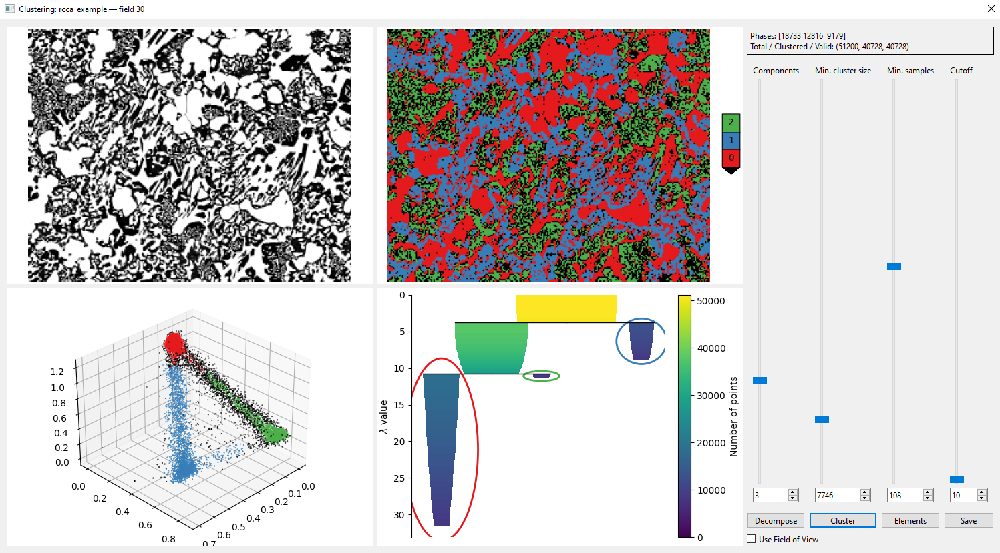

# Clustering-based analysis of EDS maps from EDAX APEX datasets

This is a tool which:

1. extracts data from EDAX APEX datasets
2. does a user-tunable cluster analysis for grouping the pixels into phases
3. exports the per-phase spectra into *.msa format (to be opened in e.g. DTSA-II analysis tool [link](https://www.cstl.nist.gov/div837/837.02/epq/dtsa2/index.html))
4. does a basic quantification of the image.

It uses Non-negative Matrix Factorization for signal decomposition and HDBSCAN for clustering.

## Usage

`eds_phanal.py [-h] filename h5path [-a | -m] [-e ELEMENTS [ELEMENTS ...]] [-b BINNING] [-q]`

### Positional arguments

  `filename`         Path to the data file

  `h5path`           Path within the H5 file to the map (`--map`) or to the group of maps (`--atlas`)

### Options

  `-h, --help`            show this help message and exit

  `-a, --atlas`           Process all maps within a single H5 group.

  `-m, --map`             Process a single map.

  `-e ELEMENTS [ELEMENTS ...], --elements ELEMENTS [ELEMENTS ...]`
  List of chemical element symbols to be used; the list from H5 file is used if not provided expicitly.
  
`-b BINNING, --binning BINNING`
Spatial binning

  `-q, --quiet`           Does not open GUI, uses previously saved parameters. Intended for batch reprocessing.

## GUI

In terminal, there will be a summary of current result.

```
Phase: [7242  798  539  289  119  110]
Total / Clustered / Valid: 12800 9097 9097
```

The first line tells you the number of pixels per each phase, the second line the total statistics – 
map size, points assigned to clusters by HDBSCAN and final points selected as valid (if cutoff is used). The same information is printed to the GUI window (top right box).

The GUI for tweaking the parameter is shown below. The meaning of plots is following:

- **top left:** color-indexed phase map, invalid points (not assigned to any cluster) are black
- **top right:** current field of view (SEM data from the h5 file)
- **bottom left:** visualization of the data in the decomposed space (first 3 dimensions only)
- **bottom right:** dendrogram of the cluster structure from the HDBSCAN library ([link](https://hdbscan.readthedocs.io/en/latest/advanced_hdbscan.html))



Running following command will show exactly the example above:

```
python .\eds_phanal.py .\examples\rcca_example.h5 /rcca_alTiTaZrNb/comps/30 -m -e Al Ti Nb Zr Ta -b 2
```

### Sliders

The sliders control various parameters of the decomposition and clustering.

- `Components` number of components (dimension) to be obtained from the decomposition algorithm
- `Min. cluster size` HDBSCAN parameter `min_cluster_size` – minimum size of a group to be considered as a valid cluster
- `Min. samples` HDBSCAN parameter `min_sample` – minimum size of a group to be considered a core of a possible cluster (before cluster merging)
- `Cutoff` postprocessing – cutoff of all phases with less points

More on HDBSCAN parameter selection can be found [here](https://hdbscan.readthedocs.io/en/latest/parameter_selection.html).

### Buttons
- `Decompose` performs decomposition and clustering with new parameters
- `Cluster` performs clustering only using the previous decomposition results.
- `Elements` shows the elemental EDS maps for the selected elements
- `Save` saves the data (maps, phase spectra and parameter) and (in atlas mode) continues to the next map
- `Use FoV` uses field-of-view image as an additional component for clustering (treated as the first dimension), so the total number of components will be `Components+1`

Decomposition is generally slower than clustering. `Decompose` has to be used when changing `Components` or toggling `Use FoV`, otherwise, using `Cluster` is sufficient.

## References

Lee, Daniel D., and H. Sebastian Seung. Learning the Parts of Objects by Non-Negative Matrix Factorization. Nature 401, no. 6755 (1999): 788–91. [https://doi.org/10.1038/44565].


L. McInnes, J. Healy, S. Astels, _hdbscan: Hierarchical density based clustering_ In: Journal of Open Source Software, The Open Journal, volume 2, number 11. 2017
